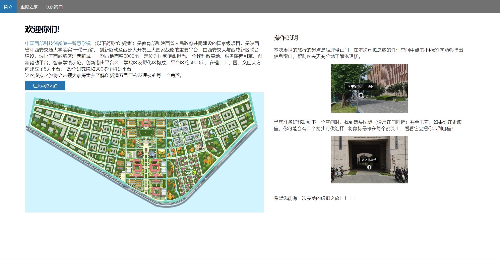
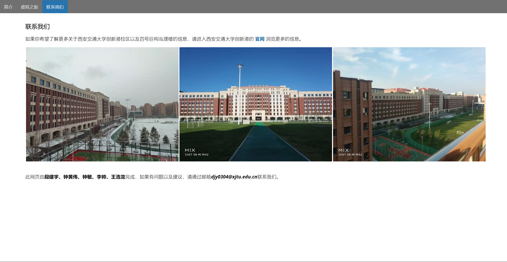

# 泓理楼的虚拟之旅

本仓库使用[Pannellum]([Pannellum](https://pannellum.org/))帮助大家虚拟参观西安交通大学创新港校区四号巨构泓理楼，每个场景都会通过信息窗口帮助各位云游客尽可能充分地了解四号楼。

## 开始你的虚拟之旅

您可以打开此仓库的根目录下的index.html,tour.html,contact.html文件开始自己的虚拟之旅。祝每一位云游客有一段美好的旅程！

